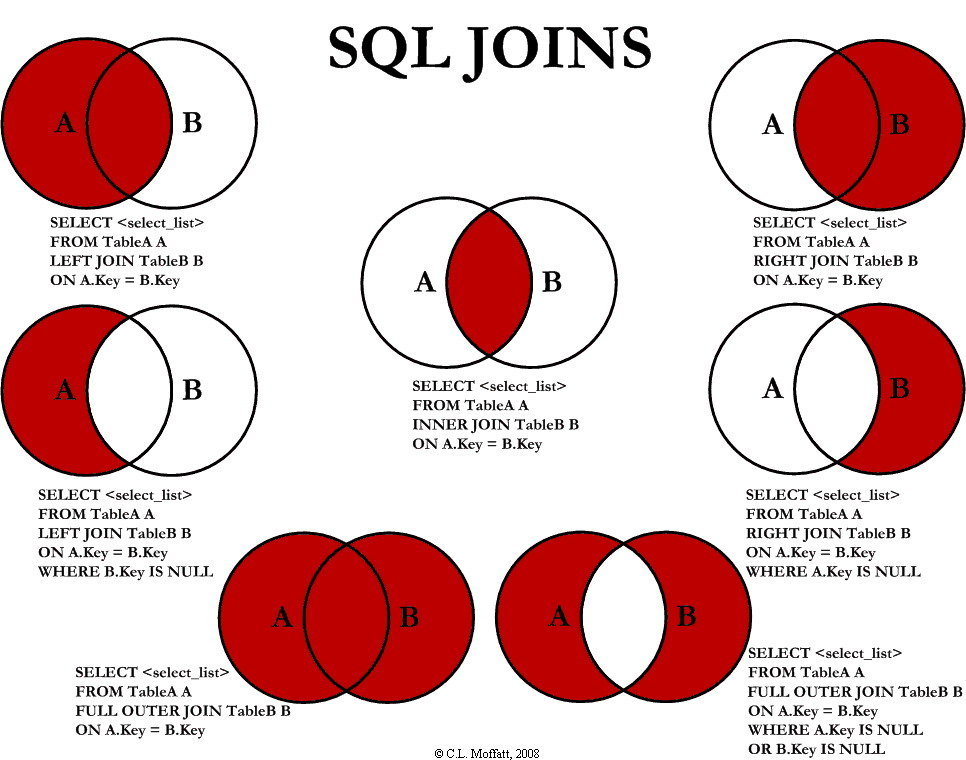

# MYSQL详解

* 参考链接

    [MySQL 三万字精华总结 + 面试100 问，和面试官扯皮绰绰有余（收藏系列）](https://juejin.im/post/6850037271233331208#heading-29)

    [47 张图带你 MySQL 进阶！！！](https://juejin.im/post/6854573212920086541#heading-17)

* [架构](#架构)
* [数据类型](#数据类型)
    * [CHAR和VARCHAR的区别？](#CHAR和VARCHAR的区别？)
    * [列的字符串类型可以是什么？](#列的字符串类型可以是什么？)
    * [BLOB和TEXT的区别？](#BLOB和TEXT的区别？)
    * [BLOB和TEXT如何提高性能](#BLOB和TEXT如何提高性能)
    * [浮点数和定点数的选择](#浮点数和定点数的选择)
    * [日期类型选择](#日期类型选择)
* [字符集](#字符集)
* [索引](索引)
    * [对MySQL索引的理解？](#对MySQL索引的理解？)
    * [索引类型](#索引类型)
    * [索引的优劣势](#索引的优劣势)
    * [索引设计原则与使用场景](#索引设计原则与使用场景)
    * [索引使用](#索引使用)
* [视图](#视图)
    * [视图的理解](#视图的理解)
    * [视图操作](#视图操作)
* [查询](#查询)
    * [count(*)和count(1)和count(列名)区别](#count(*)和count(1)和count(列名)区别)
    * [MySQL中in和exists的区别？](#MySQL中in和exists的区别？)
    * [UNION和UNIONALL的区别?](#UNION和UNIONALL的区别?)
    * [SQL执行顺序](#SQL执行顺序)
    * [各种join的区别](#各种join的区别)
* [存储过程](#存储过程)
    * [存储过程理解](#存储过程理解)
    * [存储过程使用](#存储过程使用)
* [触发器](#触发器)
* [事务](#事务)
* [锁](#锁)
* [调优](#调优)
* [数据划分](#数据划分)
* [主从复制](#主从复制)

---

## 架构

* 连接层:连接、认证、安全

    客户端和连接服务。主要完成一些类似于连接处理、授权认证、及相关的安全方案。在该层上引入了线程池的概念，为通过认证安全接入的客户端提供线程。同样在该层上可以实现基于SSL的安全链接。服务器也会为安全接入的每个客户端验证它所具有的操作权限。

* 服务层:解析、分析、优化

    完成大部分的核心服务功能，包括查询解析、分析、优化、缓存、以及所有的内置函数，所有跨存储引擎的功能也都在这一层实现，包括触发器、存储过程、视图等

* 引擎层

    存储引擎真正的负责了MySQL中数据的存储和提取，服务器通过API与存储引擎进行通信。不同的存储引擎具有的功能不同，这样我们可以根据自己的实际需要进行选取

    一个数据库中多个表可以使用不同引擎以满足各种性能和实际需求：

    * MyISAM：如果应用程序通常以检索为主，只有少量的插入、更新和删除操作，并且对事物的完整性、并发程度不是很高的话，通常建议选择 MyISAM 存储引擎。
    * InnoDB：如果使用到外键、需要并发程度较高，数据一致性要求较高，那么通常选择 InnoDB 引擎，一般互联网大厂对并发和数据完整性要求较高，所以一般都使用 InnoDB 存储引擎。
    * BDB
    * MEMORY：MEMORY 存储引擎将所有数据保存在内存中，在需要快速定位下能够提供及其迅速的访问。MEMORY 通常用于更新不太频繁的小表，用于快速访问取得结果。
    * MERGE：MERGE 的内部是使用 MyISAM 表，MERGE 表的优点在于可以突破对单个 MyISAM 表大小的限制，并且通过将不同的表分布在多个磁盘上， 可以有效地改善 MERGE 表的访问效率。
    * EXAMPLE
    * NDB Cluster
    * ARCHIVE
    * CSV
    * BLACKHOLE
    * FEDERATED

    查看与设置
    ```sql
    -- 查看支持的存储引擎
    SHOW ENGINES

    -- 查看默认存储引擎
    SHOW VARIABLES LIKE 'storage_engine'

    --查看具体某一个表所使用的存储引擎，这个默认存储引擎被修改了！
    show create table tablename

    --准确查看某个数据库中的某一表所使用的存储引擎
    show table status like 'tablename'
    show table status from database where name="tablename"

    -- 建表时指定存储引擎。默认的就是INNODB，不需要设置
    CREATE TABLE t1 (i INT) ENGINE = INNODB;
    CREATE TABLE t2 (i INT) ENGINE = CSV;
    CREATE TABLE t3 (i INT) ENGINE = MEMORY;

    -- 修改存储引擎
    ALTER TABLE t ENGINE = InnoDB;

    -- 修改默认存储引擎，也可以在配置文件my.cnf中修改默认引擎
    SET default_storage_engine=NDBCLUSTER;
    ```

    MyISAM与InnoDB区别

    * InnoDB 支持事务，MyISAM 不支持事务。这是 MySQL 将默认存储引擎从 MyISAM 变成 InnoDB 的重要原因之一；
    * InnoDB 支持外键，而 MyISAM 不支持。对一个包含外键的 InnoDB 表转为 MYISAM 会失败；
    * InnoDB 是聚簇索引，MyISAM 是非聚簇索引。聚簇索引的文件存放在主键索引的叶子节点上，因此 InnoDB 必须要有主键，通过主键索引效率很高。但是辅助索引需要两次查询，先查询到主键，然后再通过主键查询到数据。因此，主键不应该过大，因为主键太大，其他索引也都会很大。而 MyISAM 是非聚集索引，数据文件是分离的，索引保存的是数据文件的指针。主键索引和辅助索引是独立的。
    * InnoDB 不保存表的具体行数，执行select count(*) from table 时需要全表扫描。而 MyISAM 用一个变量保存了整个表的行数，执行上述语句时只需要读出该变量即可，速度很快；
    * InnoDB 最小的锁粒度是行锁，MyISAM 最小的锁粒度是表锁。一个更新语句会锁住整张表，导致其他查询和更新都会被阻塞，因此并发访问受限。这也是 MySQL 将默认存储引擎从 * MyISAM 变成 InnoDB 的重要原因之一；

    一张表，里面有ID自增主键，当insert了17条记录之后，删除了第15,16,17条记录，再把Mysql重启，再insert一条记录，这条记录的ID是18还是15 ？

    * 如果表的类型是MyISAM，那么是18。因为MyISAM表会把自增主键的最大ID 记录到数据文件中，重启MySQL自增主键的最大ID也不会丢失；
    * 如果表的类型是InnoDB，那么是15。因为InnoDB 表只是把自增主键的最大ID记录到内存中，所以重启数据库或对表进行OPTION操作，都会导致最大ID丢失。

    哪个存储引擎执行 select count(*) 更快，为什么?

    * 在 MyISAM 存储引擎中，把表的总行数存储在磁盘上，当执行 select count(*) from t 时，直接返回总数据。
    * 在 InnoDB 存储引擎中，跟 MyISAM 不一样，没有将总行数存储在磁盘上，当执行 select count(*) from t 时，会先把数据读出来，一行一行的累加，最后返回总数量。


* 存储层:磁盘储存

    将数据存储在运行于该设备的文件系统之上，并完成与存储引擎的交互

---

* 功能

    * 并发
    * 支持事务
    * 完整性约束
    * 物理存储
    * 支持索引
    * 性能帮助

## 数据类型

* 整数类型：BIT、BOOL、TINY INT、SMALL INT、MEDIUM INT、 INT、 BIG INT
* 浮点数类型：FLOAT、DOUBLE、DECIMAL
* 字符串类型：CHAR、VARCHAR、TINY TEXT、TEXT、MEDIUM TEXT、LONGTEXT、TINY BLOB、BLOB、MEDIUM BLOB、LONG BLOB
* 日期类型：Date、DateTime、TimeStamp、Time、Year
* 其他数据类型：BINARY、VARBINARY、ENUM、SET、Geometry、Point、MultiPoint、LineString、MultiLineString、Polygon、GeometryCollection等

### CHAR和VARCHAR的区别？

* char是固定长度，varchar长度可变：
* char(n) 和 varchar(n) 中括号中 n 代表字符的个数，并不代表字节个数，比如 CHAR(30) 就可以存储 30 个字符。
存储时，前者不管实际存储数据的长度，直接按 char 规定的长度分配存储空间；而后者会根据实际存储的数据分配最终的存储空间

* 相同点：
    * char(n)，varchar(n)中的n都代表字符的个数
    * 超过char，varchar最大长度n的限制后，字符串会被截断。

* 不同点：
    * char不论实际存储的字符数都会占用n个字符的空间，而varchar只会占用实际字符应该占用的字节空间加1（实际长度length，0<=length<255）或加2（length>255）。因为varchar保存数据时除了要保存字符串之外还会加一个字节来记录长度（如果列声明长度大于255则使用两个字节来保存长度）。
    * 能存储的最大空间限制不一样：char的存储上限为255字节。
    * char在存储时会截断尾部的空格，而varchar不会。

* char是适合存储很短的、一般固定长度的字符串。例如，char非常适合存储密码的MD5值，因为这是一个定长的值。对于非常短的列，char比varchar在存储空间上也更有效率。

* 在 MySQL 中，不同的存储引擎对 CHAR 和 VARCHAR 的使用原则也有不同
    * MyISAM：建议使用固定长度的数据列替代可变长度的数据列，也就是 CHAR
    * MEMORY：使用固定长度进行处理、CHAR 和 VARCHAR 都会被当作 CHAR 处理
    * InnoDB：建议使用 VARCHAR 类型

### 列的字符串类型可以是什么？

字符串类型是：SET、BLOB、ENUM、CHAR、TEXT、VARCHAR

### BLOB和TEXT的区别？

* BLOB是一个二进制对象，可以容纳可变数量的数据。有四种类型的BLOB：TINYBLOB、BLOB、MEDIUMBLO和 LONGBLOB
* TEXT是一个不区分大小写的BLOB。四种TEXT类型：TINYTEXT、TEXT、MEDIUMTEXT 和 LONGTEXT。
* BLOB 保存二进制数据，TEXT 保存字符数据。

### BLOB和TEXT如何提高性能

* 使用 OPTIMIZE TABLE 功能对表进行碎片整理。
* 使用合成索引

    合成索引就是根据大文本（BLOB 和 TEXT）字段的内容建立一个散列值，把这个值存在对应列中，这样就能够根据散列值查找到对应的数据行。一般使用散列算法比如 md5() 和 SHA1() ，如果散列算法生成的字符串带有尾部空格，就不要把它们存在 CHAR 和 VARCHAR 中
* 非必要的时候不要检索 BLOB 和 TEXT 索引
* 把 BLOB 或 TEXT 列分离到单独的表中。

### 浮点数和定点数的选择

浮点数指的就是 float 和 double，定点数指的是 decimal，定点数能够更加精确的保存和显示数据。

### 日期类型选择

* TIMESTAMP 和时区相关，更能反映当前时间，如果记录的日期需要让不同时区的人使用，最好使用 TIMESTAMP。
* DATE 用于表示年月日，如果实际应用值需要保存年月日的话就可以使用 DATE。
* TIME 用于表示时分秒，如果实际应用值需要保存时分秒的话就可以使用 TIME。
* YEAR 用于表示年份，YEAR 有 2 位（最好使用4位）和 4 位格式的年。 默认是4位。如果实际应用只保存年份，那么用 1 bytes 保存 YEAR 类型完全可以。不但能够节约存储空间，还能提高表的操作效率。

## 字符集

|字符集     |是否定长|编码方式          |
|----------|-------|-----------------|
|ASCII     |是     |单字节 7 位编码    |
|ISO-8859-1|是     |单字节 8 位编码    |
|GBK       |是     |双字节编码         |
|UTF-8     |否     |1 - 4 字节编码    |
|UTF-16    |否     |2 字节或 4 字节编码|
|UTF-32    |是     |4 字节编码        |

查看方法
```sql
select character_set_name, default_collate_name, description, maxlen from information_schema.character_sets;
```

## 索引

### 对MySQL索引的理解？

* 索引（Index）是帮助MySQL高效获取数据的数据结构，所以说索引的本质是：数据结构

* 索引的目的在于提高查询效率，可以类比字典、 火车站的车次表、图书的目录等 。

* 所有的 MySQL 类型都可以进行索引，对相关列使用索引是提高 SELECT 查询性能的最佳途径。MyISAM 和 InnoDB 都是使用 BTREE 作为索引，MySQL 5 不支持函数索引，但是支持 前缀索引。(前缀索引顾名思义就是对列字段的前缀做索引，前缀索引的长度和存储引擎有关系。MyISAM 前缀索引的长度支持到 1000 字节，InnoDB 前缀索引的长度支持到 767 字节，索引值重复性越低，查询效率也就越高。)

* 可以简单的理解为“排好序的快速查找数据结构”，数据本身之外，数据库还维护着一个满足特定查找算法的数据结构，这些数据结构以某种方式引用（指向）数据，这样就可以在这些数据结构上实现高级查找算法。

* 索引本身也很大，不可能全部存储在内存中，一般以索引文件的形式存储在磁盘上

* 平常说的索引，没有特别指明的话，就是B+树（多路搜索树，不一定是二叉树）结构组织的索引。其中聚集索引，次要索引，覆盖索引，复合索引，前缀索引，唯一索引默认都是使用B+树索引，统称索引。此外还有哈希索引等。

### 索引类型

* 数据结构角度

    * 全局索引(FULLTEXT)：全局索引，目前只有 MyISAM 引擎支持全局索引，它的出现是为了解决针对文本的模糊查询效率较低的问题，并且只限于 CHAR、VARCHAR 和 TEXT 列。

    * 哈希索引(HASH)：哈希索引是 MySQL 中用到的唯一 key-value 键值对的数据结构，很适合作为索引。HASH 索引具有一次定位的好处，不需要像树那样逐个节点查找，但是这种查找适合应用于查找单个键的情况，对于范围查找，HASH 索引的性能就会很低。默认情况下，MEMORY 存储引擎使用 HASH 索引，但也支持 BTREE 索引。

    * B-Tree 索引：B 就是 Balance 的意思，BTree 是一种平衡树，它有很多变种，最常见的就是 B+ Tree，它被 MySQL 广泛使用。

    * R-Tree 索引：R-Tree 在 MySQL 很少使用，仅支持 geometry 数据类型，支持该类型的存储引擎只有MyISAM、BDb、InnoDb、NDb、Archive几种，相对于 B-Tree 来说，R-Tree 的优势在于范围查找。

* 物理存储角度

    * 聚集索引（clustered index）

    * 非聚集索引（non-clustered index），也叫辅助索引（secondary index）

    * 聚集索引和非聚集索引都是B+树结构

* 逻辑角度

    * 主键索引：主键索引是一种特殊的唯一索引，不允许有空值

    * 普通索引或者单列索引：每个索引只包含单个列，一个表可以有多个单列索引

    * 多列索引（复合索引、联合索引）：复合索引指多个字段上创建的索引，只有在查询条件中使用了创建索引时的第一个字段，索引才会被使用。使用复合索引时遵循最左前缀集合

    * 唯一索引或者非唯一索引

    * 空间索引：空间索引是对空间数据类型的字段建立的索引，MYSQL中的空间数据类型有4种，分别是GEOMETRY、POINT、LINESTRING、POLYGON。MYSQL使用SPATIAL关键字进行扩展，使得能够用于创建正规索引类型的语法创建空间索引。创建空间索引的列，必须将其声明为NOT NULL，空间索引只能在存储引擎为MYISAM的表中创建

### 索引的优劣势

* 优势

    * 提高数据检索效率，降低数据库IO成本

    * 降低数据排序的成本，降低CPU的消耗

* 劣势

    * 索引也是一张表，保存了主键和索引字段，并指向实体表的记录，所以也需要占用内存

    * 虽然索引大大提高了查询速度，同时却会降低更新表的速度，如对表进行INSERT、UPDATE和DELETE。因为更新表时，MySQL不仅要保存数据，还要保存一下索引文件每次更新添加了索引列的字段，都会调整因为更新所带来的键值变化后的索引信息

### 索引设计原则与使用场景

* 选择索引位置，选择索引最合适的位置是出现在 where 语句中的列，而不是 select 关键字后的选择列表中的列。

* 选择使用唯一索引，可以更快速的确定某条记录，例如学生的学号就适合使用唯一性索引，而学生的性别则不适合使用，因为不管搜索哪个值，都差不多有一半的行。

* 为经常使用的字段建立索引，如果某个字段经常用作查询条件，那么这个字段的查询速度在极大程度上影响整个表的查询速度，因此为这样的字段建立索引，可以提高整个表的查询速度。

* 不要过度索引，限制索引数目，索引的数目不是越多越好，每个索引都会占据磁盘空间，索引越多，需要的磁盘空间就越大。

* 尽量使用前缀索引，如果索引的值很长，那么查询速度会受到影响，这个时候应该使用前缀索引，对列的某几个字符进行索引，可以提高检索效率。

* 利用最左前缀，在创建一个 n 列的索引时，实际上是创建了 MySQL 可利用的 n 个索引。多列索引可以起到几个索引的作用，利用索引最左边的列来匹配行，这样的列称为最左前缀。

* 对于使用 InnoDB 存储引擎的表来说，记录会按照一定的顺序保存。如果有明确的主键定义，那么会按照主键的顺序进行保存；如果没有主键，但是有唯一索引，那么就按照唯一索引的顺序进行保存。如果既没有主键又没有唯一索引，那么表中会自动生成一个内部列，按照这个列的顺序进行保存。一般来说，使用主键的顺序是最快的

* 删除不再使用或者很少使用的索引

* 需要创建索引的情况：

    * 主键自动建立唯一索引

    * 频繁作为查询条件的字段

    * 查询中与其他表关联的字段，外键关系建立索引

    * 单键/组合索引的选择问题，高并发下倾向创建组合索引

    * 查询中排序的字段，排序字段通过索引访问大幅提高排序速度

    * 查询中统计或分组字段

* 不要创建索引的情况：

    * 表记录太少

    * 经常增删改的表

    * 数据重复且分布均匀的表字段，只应该为最经常查询和最经常排序的数据列建立索引（如果某个数据类包含太多的重复数据，建立索引没有太大意义）

    * 频繁更新的字段不适合创建索引（会加重IO负担）

    * where条件里用不到的字段不创建索引

### 索引使用

* 创建：

    * 创建索引：CREATE [UNIQUE] INDEX indexName ON mytable(username(length));

        如果是CHAR，VARCHAR类型，length可以小于字段实际长度；如果是BLOB和TEXT类型，必须指定 length。

    * 修改表结构(添加索引)：ALTER table tableName ADD [UNIQUE] INDEX indexName(columnName)

* 删除：DROP INDEX [indexName] ON mytable;

* 查看：SHOW INDEX FROM table_name\G  --可以通过添加 \G 来格式化输出信息。

* 使用ALERT命令

    * ALTER TABLE tbl_name ADD PRIMARY KEY (column_list): 该语句添加一个主键，这意味着索引值必须是唯一的，且不能为NULL。
    * ALTER TABLE tbl_name ADD UNIQUE index_name (column_list 这条语句创建索引的值必须是唯一的（除了NULL外，NULL可能会出现多次）。
    * ALTER TABLE tbl_name ADD INDEX index_name (column_list) 添加普通索引，索引值可出现多次。
    * ALTER TABLE tbl_name ADD FULLTEXT index_name (column_list)该语句指定了索引为 FULLTEXT ，用于全文索引。

## 视图

### 视图的理解

* 它是一种虚拟存在的表，它并不在数据库中实际存在，视图是使用数据库行和列动态组成的表。

* 视图相对于普通的表有如下优势：

    * 使用视图可以简化操作：使用视图我们不用关注表结构的定义，我们可以把经常使用的数据集合定义成视图，这样能够简化操作。
    * 安全性：用户对视图不可以随意的更改和删除，可以保证数据的安全性。
    * 数据独立性：一旦视图的结构 确定了， 可以屏蔽表结构变化对用户的影响， 数据库表增加列对视图没有影响；具有一定的独立性

### 视图操作

* 创建：create view v1 as select * from product;
* 查看所有视图：show tables;
* 删除：drop view v1;
* 查看视图结构：describe v1;
* 更新视图：update v1 set name = "grape" where id = 1;

## 查询

### count(*)和count(1)和count(列名)区别

* 执行效果上：

    * count(*)包括了所有的列，相当于行数，在统计结果的时候，不会忽略列值为NULL
    * count(1)包括了所有列，用1代表代码行，在统计结果的时候，不会忽略列值为NULL
    * count(列名)只包括列名那一列，在统计结果的时候，会忽略列值为空（这里的空不是只空字符串或者0，而是表示null）的计数，即某个字段值为NULL时，不统计。

* 执行效率上：

    * 列名为主键，count(列名)会比count(1)快
    * 列名不为主键，count(1)会比count(列名)快
    * 如果表多个列并且没有主键，则 count(1) 的执行效率优于 count(*)
    * 如果有主键，则 select count（主键）的执行效率是最优的
    * 如果表只有一个字段，则 select count(*) 最优。

### MySQL中in和exists的区别？

* exists：exists对外表用loop逐条查询，每次查询都会查看exists的条件语句，当exists里的条件语句能够返回记录行时（无论记录行是的多少，只要能返回），条件就为真，返回当前loop到的这条记录；反之，如果exists里的条件语句不能返回记录行，则当前loop到的这条记录被丢弃，exists的条件就像一个bool条件，当能返回结果集则为true，不能返回结果集则为false

* in：in查询相当于多个or条件的叠加

* 如果查询的两个表大小相当，那么用in和exists差别不大。

* 如果两个表中一个较小，一个是大表，则子查询表大的用exists，子查询表小的用in：

### UNION和UNIONALL的区别?

* UNION和UNION ALL都是将两个结果集合并为一个，两个要联合的SQL语句 字段个数必须一样，而且字段类型要“相容”（一致）；

* UNION在进行表连接后会筛选掉重复的数据记录（效率较低），而UNION ALL则不会去掉重复的数据记录；

* UNION会按照字段的顺序进行排序，而UNION ALL只是简单的将两个结果合并就返回；

### SQL执行顺序

* 手写

    ```sql
    SELECT DISTINCT <select_list>
    FROM  <left_table> <join_type>
    JOIN  <right_table> ON <join_condition>
    WHERE  <where_condition>
    GROUP BY  <group_by_list>
    HAVING <having_condition>
    ORDER BY <order_by_condition>
    LIMIT <limit_number>
    ```

* 机读

    ```sql
    FROM  <left_table>
    ON <join_condition>
    <join_type> JOIN  <right_table> 
    WHERE  <where_condition>
    GROUP BY  <group_by_list>
    HAVING <having_condition>
    SELECT
    DISTINCT <select_list>
    ORDER BY <order_by_condition>
    LIMIT <limit_number>
    ```

* 顺序

    from/on->join/where->group by/having->select/order by->limit

### 各种join的区别



## 存储过程

### 存储过程理解

* 存储过程是在数据库系统中完成一组特定功能的 SQL 语句集，它存储在数据库系统中，一次编译后永久有效。

* 优点：

    * 使用存储过程具有可封装性，能够隐藏复杂的 SQL 逻辑。
    * 存储过程可以接收参数，并返回结果
    * 存储过程性能非常高，一般用于批量执行语句

* 缺点：

    * 存储过程编写复杂
    * 存储过程对数据库的依赖性比较强，可移植性比较差

### 存储过程使用

* 创建

    ```sql
    -- delimiter 自定义符号 包裹的部分执行完才有结果
    delimiter $$
    create procedure sp_product()
    begin
    select * from product;
    end $$
    ```

* 调用和传参

    ```sql
    call sp_product(2)
    ```

* 删除

    ```sql
    drop procedure sp_product ;
    ```

* 查看

    ```sql
    show create procedure proc_name;
    ```

* 变量

    * 用户变量

        用户变量是基于会话变量实现的，可以暂存，用户变量与连接有关，也就是说一个客户端定义的变量不能被其他客户端使用看到。当客户端退出时，链接会自动释放。

        ```sql
        set @myId = "cxuan";
        ```

    * 局部变量

        作用域是所在的存储过程，使用 declare 来声明

    * 会话变量

        服务器会为每个连接的客户端维护一个会话变量。

        查看和使用
        ```sql
        show session variables;
        set session auto_increment_increment=1;
        --或者使用
        set @@session.auto_increment_increment=2;
        ```

    * 全局变量

        当服务启动时，它将所有全局变量初始化为默认值。其作用域为 server 的整个生命周期。

        查看和使用
        ```sql
        show global variables;
        set global sql_warnings=ON;
        --或者使用
        set @@global.sql_warnings=OFF;
        ```

* 流程语句

    * IF

        ```txt
        IF ... THEN ...
        ```

    * CASE

        ```txt
        CASE ...
            WHEN ... THEN...
            ...
        END CASE
        ```

    * LOOP

        ```txt
        label:LOOP
            ...
        END LOOP label;
        ```

    * LEAVE

        用来表示从标注的流程构造中退出，通常和 BEGIN...END 或者循环一起使用

    * ITERATE

        ITERATE 语句必须用在循环中，作用是跳过当前循环的剩下的语句，直接进入下一轮循环。

    * REPEAT相当于do while

        ```txt
        REPEAT
            ... 
            UNTIL
        END REPEAT;
        ```

    * WHILE与repeat类似

## 触发器

触发器一般作用在表上，在满足定义条件时触发，并执行触发器中定义的语句集合，比如你有一个日志表和金额表，你每录入一笔金额就要进行日志表的记录

* 触发器的作用

    * 在添加一条数据前，检查数据是否合理，例如检查邮件格式是否正确
    * 删除数据后，相当于数据备份的作用
    * 可以记录数据库的操作日志，也可以作为表的执行轨迹

* 触发器的使用有两个限制

    * 触发程序不能调用将数据返回客户端的存储程序。也不能使用 CALL 语句的动态 SQL 语句。
    * 不能在触发器中开始和结束语句，例如 START TRANSACTION

* 创建

    时机+事件组成6种触发器
    ```sql
    create trigger 触发器的名字 触发器触发时机(BEFORE 还是 AFTER) 触发器触发事件(INSERT、UPDATE 或者 DELETE) on 触发器创建的表名 for each row 触发器的程序体(sql语句)
    ```

* 删除

    ```sql
    drop trigger tg_pinfo;
    ```

* 查看

    ```sql
    show triggers
    ```

## 事务


## 锁


## 调优


## 数据划分


## 主从复制


